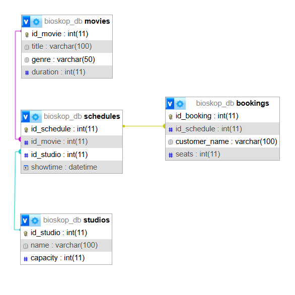

# TP10DPBO2425C2

Saya Niha April Miani dengan NIM 2402567 mengerjakan Tugas Praktikum 10 dalam mata kuliah Desain Pemogramana Berorientasi Objek untuk keberkahanNya maka saya tidak melakukan kecurangan seperti yang telah dispesifikasikan. Aamiin

## Desain Tabel ##

### a. movies ###
- Menyimpan data film
- Atribut: id_movie, title, genre, duration
- Digunakan sebagai referensi jadwal
  
### b. studios
- Menyimpan data studio bioskop
- Atribut: id_studio, name, capacity
  
### c. schedules
- Menyimpan jadwal tayang
- Atribut: id_schedule, id_movie, id_studio, showtime
- Relasi:
  - id_movie → movies.id_movie
  - id_studio → studios.id_studio
    
### d. bookings
- Menyimpan pemesanan tiket
- Atribut: id_booking, id_schedule, customer_name, seats
- Relasi:
  - id_schedule → schedules.id_schedule
  - Kesimpulan

## Desain Program
### a. Model
- Berisi fungsi akses database (CRUD)
- File: MovieModel.php, StudioModel.php, ScheduleModel.php, BookingModel.php

### b. ViewModel
- Menjembatani View dan Model
- Mengelola logika CRUD dan validasi
- File: MovieVM.php, StudioVM.php, ScheduleVM.php, BookingVM.php

### c. View
- Halaman antarmuka (HTML + Bootstrap)
- File add.php, edit.php, index.php untuk setiap tabel

### d. Router (index.php)
- Mengatur navigasi halaman
- Menentukan View yang ditampilkan lewat parameter page=...

## Alur Program
### 1. User membuka aplikasi
- Halaman Home tampil (tombol Film/Studio/Jadwal/Booking)

### 2. User memilih menu (misl Film)
- Router (index.php) membaca parameter ?page=movies
- Router memanggil View: /Views/movies/index.php
- ViewModel mengambil data dari Model
- Data film ditampilkan di tabel

### 3. User menambah data
- Masuk ke /Views/movies/add.php
- View mengirim form → ViewModel → Model → Database

### 4. User mengedit data
- View tampilkan data lama
- Perubahan dikirim ke ViewModel → Model → Database

### 5. User menghapus data
- Router memanggil fungsi delete di ViewModel
- ViewModel memanggil Model untuk hapus data

### 6. Booking & Jadwal mengakses relasi
- Jadwal mengambil film & studio dari tabel lain
- Booking mengambil schedule untuk pemesanan

### Alur Besar
User → Router → View → ViewModel → Model → Database → Kembali ke View

## Stuktur Folder

### Penjelasan Singkat
- Config/: koneksi database
- Models/: logika akses database
- ViewModels/: logika CRUD & binding data
- Views/: tampilan berbasis Bootstrap
- index.php: router dan kontrol halaman

## Dokumentasi
### Film

### Studio

### Jadwal

### Booking

